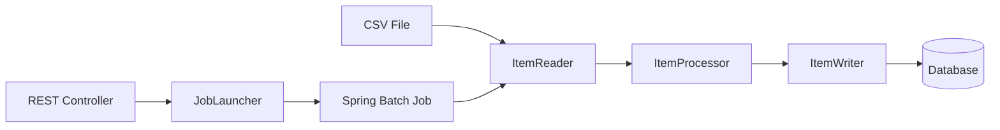

# 🚀 Spring Batch Processing API


---

## 📌 Overview

Aplicação desenvolvida com **Java e Spring Batch** para execução de processamento em lote baseado em arquivos CSV, com leitura estruturada, transformação de dados e persistência em banco relacional.

O projeto implementa um fluxo completo de batch processing utilizando:

- Job
- Step
- ItemReader
- ItemProcessor
- ItemWriter
- Execução via API REST

---

## 🏗 Arquitetura da Aplicação



A aplicação permite disparar o processamento sob demanda através de um endpoint HTTP, garantindo flexibilidade e controle operacional.

---

## ⚙️ Tecnologias Utilizadas

- Java 25
- Spring Boot 4.0
- Spring Batch
- Spring Data JPA
- REST API
- Banco de Dados Relacional
- Gradle

---

## 🔄 Fluxo de Processamento

### 1️⃣ Leitura
- Importação de dados via arquivo CSV
- Configuração de `FlatFileItemReader`
- Mapeamento com `FieldSetMapper`

### 2️⃣ Processamento
- Implementação de `ItemProcessor`
- Tratamento e transformação de dados
- Validações durante o fluxo

### 3️⃣ Escrita
- Persistência em banco de dados
- Uso de `ItemWriter`
- Commit transacional por chunk

### 4️⃣ Execução
- Job configurado com múltiplos Steps
- Execução manual via API REST
- Controle de execução e logs

---

## 🌐 Endpoint para Execução

```
POST /batch/run
```

Este endpoint dispara o Job configurado no Spring Batch, iniciando o processamento em lote de forma programática.

---

## 🧩 Componentes Implementados

- Configuração completa de Job e Step
- Custom ItemProcessor
- Integração entre leitura e escrita
- Controle transacional por chunk
- Estrutura modular organizada
- Tratamento de falhas no processamento

---

## 🗂 Estrutura do Projeto

```
src
 ├── config
 │    └── BatchConfig
 ├── controller
 │    └── BatchController
 ├── processor
 │    └── CustomItemProcessor
 ├── reader
 ├── writer
 ├── model
 └── repository
```

---

## ▶️ Execução

### Pré-requisitos

- Java 25
- Gradle 8+
- Banco de dados configurado

### Build

```bash
gradle build
```

### Run

```bash
gradle bootRun
```

---

## 📈 Objetivos Técnicos

Este projeto demonstra:

✔ Processamento em lote  
✔ Arquitetura baseada em jobs  
✔ Separação de responsabilidades  
✔ Integração com banco de dados  
✔ Controle programático de execução  
✔ Manipulação de dados em pipeline  

---

## 👨‍💻 Author

**Rafael Junio Moraes**  
GitHub: https://github.com/Rafael01Gx  
Backend Developer | Java & Spring Ecosystem
